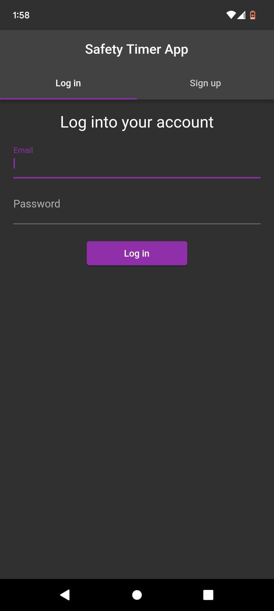
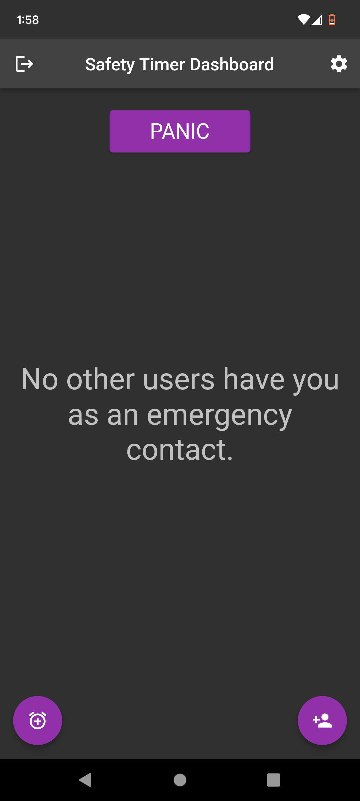
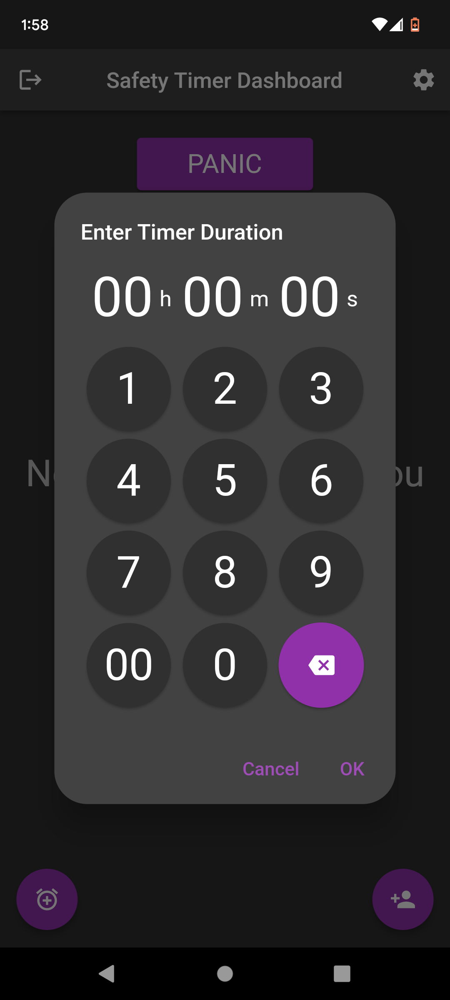
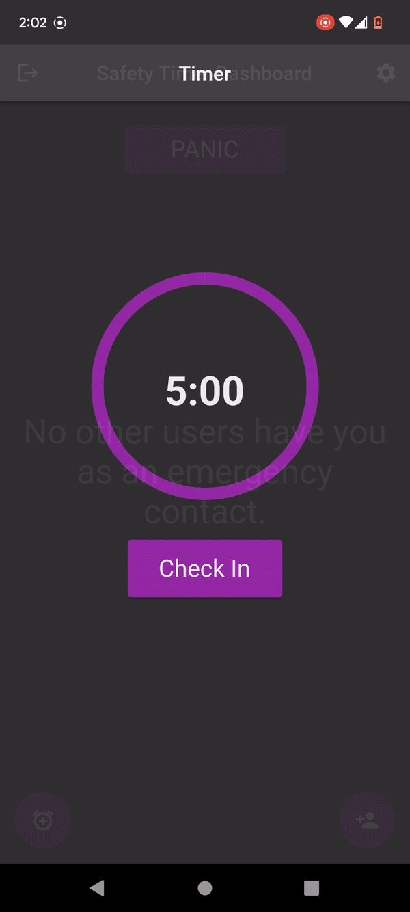
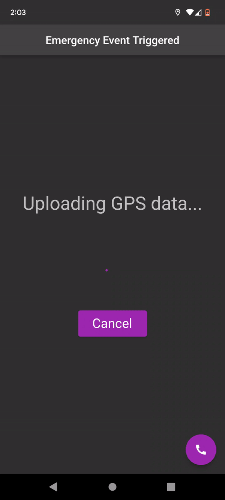

# Safety Timer App
 
This is an android mobile application made in Flutter using Firebase cloud store to host data and Firebase Authentication to authenticate users.

This is a safety app that is designed to keep users safe by  utilizing various trigger mechanisms that will notify emergency contacts (other users) that something went wrong and then these contacts will be able to view gps data from the user who triggered the notification.

This app is currently a work in progress, so screenshots of the final version and an APK file will be available upon completion.

Also, if you plan on using this code, it will not work for you out of the gate because I have excluded some files that contain sensistive data, such as a google-services.json file that is used to connect the app to a firebase database, you will have to create your own database and add said file into android/app directory. This also applies to a SensitiveGlobals.dart file that contains other sensitive data such as a google maps API key.

Addendum: AndroidManifest.xml has also been removed because it now contains an API key.

 

## Login screen shown when you first open the app.

 

## Default dashboard after logging in.

 

## This is the timer duration picker.

 

## Timer count down.

 

## Emergency event triggered, emergency contacts notified and GPS uploading.

 

## Map view of an emergency dependee uploading GPS points.

